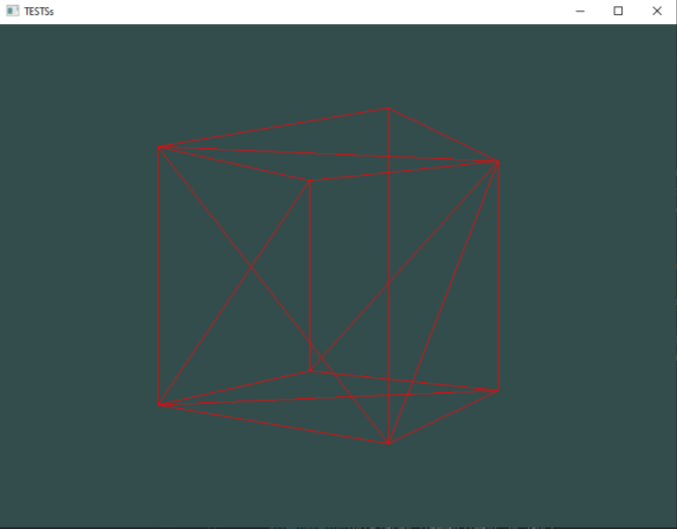

# BasicCubeOpenGL

Um simples cubo usando OpenGL em C++.

## Compilação

Para compilar no Windows, use o arquivo: [`compile.bat`](./compile.bat)

No linux, use:

*Não pude testar no linux.*

Após a compilação, o executavel vai ser encontrado na pasta `build/bin/.`

